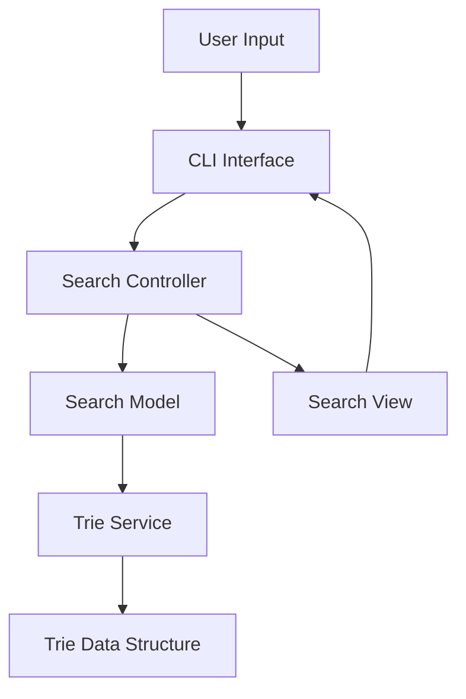
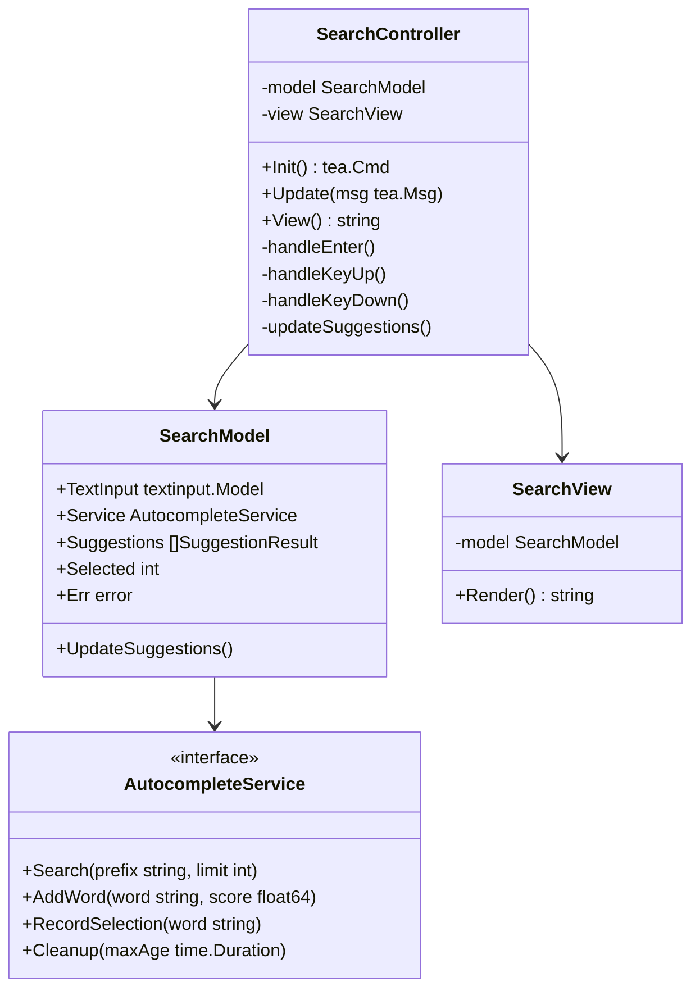

# Autocomplete CLI Application

A command-line autocomplete application built in Go using a custom Trie data structure and the Bubble Tea framework. The application provides real-time suggestions as users type, with support for weighted scoring based on frequency and recency of selections.

## 🏗 Architecture

The application follows the Model-View-Controller (MVC) pattern and uses clean architecture principles.

### High-Level Design



### Low-Level Design



## 🌟 Features

- Real-time autocomplete suggestions
- Weighted scoring system based on:
  - Base word score
  - Usage frequency
  - Recency of selection
- LRU Cache for performance optimization
- Thread-safe operations
- Configurable suggestion limits
- MVC architecture for clean code organization

## 🏛 Project Structure

```bash
.
├── Readme.md
├── go.mod
├── go.sum
├── internal
│   ├── controllers
│   │   └── search_controller.go
│   ├── models
│   │   ├── search.go
│   │   └── trie
│   │       ├── autocomplete.go
│   │       ├── suggestions.go
│   │       ├── trie.go
│   │       └── trie_autocomplete_service.go
│   └── views
│       └── search_view.go
└── main.go
```

## 🛠 Technical Implementation

### Trie Data Structure

- Custom implementation with weighted scoring
- Thread-safe operations using mutex
- LRU cache for performance optimization
- O(L) time complexity for searches, where L is the length of the prefix

### Scoring System

The scoring system combines three factors:

1. Base Score: Initial weight of the word
2. Frequency: How often the word is selected
3. Recency: How recently the word was selected

Formula:

```
final_score = (base_score * base_weight) +
              (frequency * frequency_weight) +
              (recency_factor * recency_weight)
```
